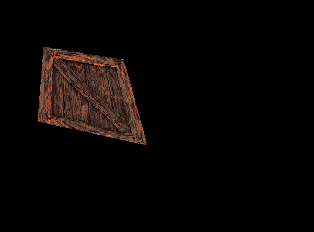
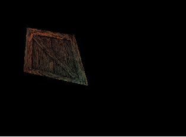
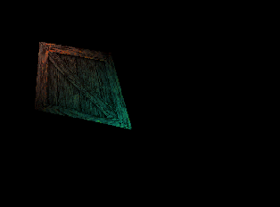
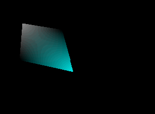
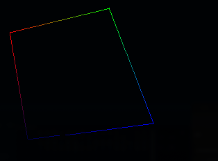

# Astra Rendering Interface

The ARI chip is a graphics accelerator that takes processes command lists and renders primitives onto a frame buffer. It is meant to be the ultimate sprite machine, rendering rectangular sprites and arbitrarily deformed quads. It also has access to a powerful colour mixer, able to mix and modify the framebuffer with colours, gradients and textures.

## ARI control registers

### 0x000000 | `STATUS` | Status Register

| Bit | Name   | Description |
| :-- | :----- | :---------- |
| 0   | Start  | Indicates to the chip that the command list is ready for processing |

### 0x000001 - 0x000003 | `START` | ARI start vector

ARI will process commands starting on this address, basically tells where to start working from after being told to start a new frame.

### 0x000004 - 0x00000F | `PAL1 - PAL4` | Palette Bank Adresses

Stores addresses for the four available palette banks, each address being 3 bytes wide, these addresses are used in the palette indexes used in the commands.

### 0x000010 - 0x00001B | `TEX1 - TEX4` | Texture Bank Adresses 

Similar to the pallete bank addresses, but for the texture indexes, behave the same way.

### 0x00001C - 0x00001F | `FB` | Framebuffer Adress

This is the address of the framebuffer, or better defined as the draw target for ARI.

### 0x000020 - 0x000022 | `SIZE` | Framebuffer Size

Represents the size of the current framebuffer, as such:

| Byte 1 | Byte 2 | Byte 3 |
| :-: | :-: | :-: |
| width ( upper 8 bits ) | width ( lower 8 bits ) | height |

for reference, the standard framebuffer of 320x240 has a size of ~153.6kb.

**Note:** By the time ARI finishes processing a frame ( end of command list), the framebuffer size *needs* to be set to 320x240. So don't forget to reset this if you mess with draw targets and texture rendering!!

## Texture formats

ARI supports 4 texture formats, which are selected by bits 5 and 6 of the control byte:

| Format | Description | Size ( for a 256x256 texture) |
| :-: | :-: | :-: |
| 00 | 8bpp palette mode | 64kb |
| 01 | 4bpp palette mode | 32kb |
| 10 | 16-bit ARGB mode | 128kb |
| 11 | 8bpp grayscale mode | 32kb |

## General command format

Draw commands are always 32 bytes long, and generally follow the same formatting:

### Byte 1 - 8

These have general controls and will be present in all instructions ( excluding byte 4):

| Byte 1 | Byte 2-3 | Byte 4 | Byte 5-7| Byte 8 |
| :-: | :-: | :-: | :-: | :-: 
| Control | Branch offset | Render Control | next command address | unused |

#### Byte 1:

|Bits | Description |
| :-: | :-: |
| 0-2 | Command type|
| 3-4 | Jump type |
| 5-6 | Texture format|
| 7   | Relative branch sign bit |

#### Byte 4:

|Bits | Description |
| :-: | :-: |
| 0-1 | Palette index|
| 2-3 | Texture index|
| 4 | Gouraud Enable|
| 5-7   | Gouraud lighting intensity |

### Byte 9-24

This chunk defines four packed vertex, each having a 15-bit RGB value and an X/Y position:

| Byte 1-2 | Byte 3 | Byte 4 |
| :-: | :-: | :-: |
| 15 bit RGB data and upper X bit| lower X position | Y position | 

### Byte 25-32

These bytes define 4 UV coordinates, as one byte for the X component and one for the Y, not much mistery to how they are encoded!

## ARI command types

These are the available operations on ARI, selected from the first 3 bits of the first byte of a command, they all follow the same general format, with mild differences ( mostly bytes being modified or disabled)

**Note:** For the tables, "-" means that the byte is an extension of the previous field (for values larger than 8 bits), and "X" means that the byte is not used.

### Type 1 - Texture Quad Mode

Draws a quad with a texture mapped onto it, this is the most advanced command available, using every single byte on the command.

| Byte 1 | Byte 2 | Byte 3 | Byte 4 | 
| :-: | :-: | :-: | :-: 
| ccc.jj.mm.s | branch offset | - | aa.bb.g.iii |
| next command address | - | - | pallete offset |
| RGB15 data / upper bit X pos| -     | lower 8 bits X position | Y position |
| RGB15 data / upper bit X pos| -     | lower 8 bits X position | Y position |
| RGB15 data / upper bit X pos| -     | lower 8 bits X position | Y position |
| RGB15 data / upper bit X pos| -     | lower 8 bits X position | Y position |
| UV A X pos | UV A Y pos | UV B X pos | UV B Y pos |
| UV C X pos | UV C Y pos | UV D X pos | UV D Y pos |

The algorithm for the Gouraud shading is a little janky, but it kind of works with multiplying the sampled texture colour with a gradient of the four vertex colours ( as a normalized value), not sure though, I wrote that logic at midnight after driking a can of monster, and it looks too good for me to rewrite it. Here are some examples of rendered quads:  
   

### Type 2 - Color Quad Mode

Similar to the textured quad Mode, but draws the quad as a solid colour gradient, these colours are already used for the Gouraud calculations, so there is no extra cost to rendering these.

| Byte 1 | Byte 2 | Byte 3 | Byte 4 | 
| :-: | :-: | :-: | :-: 
| ccc.jj.mm.s | branch offset | - | X |
| next command address | - | - | X |
| RGB15 data / upper bit X pos| -     | lower 8 bits X position | Y position |
| RGB15 data / upper bit X pos| -     | lower 8 bits X position | Y position |
| RGB15 data / upper bit X pos| -     | lower 8 bits X position | Y position |
| RGB15 data / upper bit X pos| -     | lower 8 bits X position | Y position |
| X | X | X | X |
| X | X | X | X |

### Type 3 - Sprite Mode

Not much mistery to this one, it just draws a sprite with no effects, there is an extra byte for controlling the sprite. Size of the sprite is determined by (uvB.x - uvA.x; uvB.y - uvA.y). If you need extra control like scaling, shearing, rotation or any other distortion, you should use the textured quad mode instead!

| Byte 1 | Byte 2 | Byte 3 | Byte 4 | 
| :-: | :-: | :-: | :-: 
| ccc.jj.mm.s | branch offset | - | aa.bb.g.iii |
| next command address | - | - | pallete offset |
| sprite control | upper bit X position | lower 8 bits X position | Y position |
| X | X | X | X |
| X | X | X | X |
| X | X | X | X |
| UV A X pos | UV A Y pos | UV B X pos | UV B Y pos |
| X | X | X | X |

Sprite control byte description:
|Bits | Description |
| :-: | :-: |
| 0 | flip X|
| 1 | flip Y |
| 2 | transparency enable |
| 3-7 | unused |

### Type 4 - Color Math Mode

This is the big one, possibly the best feature of the whole chip, the colour mixer allows for you to mix a colour source to the one on the framebuffer, it has 8 modes of operation, 4 sources to choose from and the option to modify singular channels or the whole pixel.

| Byte 1 | Byte 2 | Byte 3 | Byte 4 | 
| :-: | :-: | :-: | :-: 
| ccc.jj.mm.s | branch offset | - | aa.bb.g.iii |
| next command address | - | - | pallete offset |
| RGB15 data / upper bit X pos| -     | lower 8 bits X position | Y position |
| RGB15 data / upper bit X pos| -     | lower 8 bits X position | Y position |
| RGB15 data / upper bit X pos| -     | lower 8 bits X position | Y position |
| RGB15 data / upper bit X pos| -     | lower 8 bits X position | Y position |
| colour control | X | operand | - |
| first UV X | first UV Y | second UV X | second UV Y |

It is very similar to the textured quad mode, except for that misterious colour control byte, here it is in more detail:

|Bits | Description |
| :-: | :-: |
| 0-2 | operation type |
| 3-4 | source |
| 5-6 | operation mode |
| 7 | unused |

Operation types:
| op. number | operation | description |
| :-: | :-: | :- |
| 1 | add |  F = S + F |
| 2 | sub |  F = F - S |
| 3 | mul |  F = F * S |
| 4 | div |  F = F / S |
| 5 | lerp | F = lerp(F, S, operand ( lower 8 bits )) |
| 6 | compare & discard | compares the sampled source colour with the operand, if they are equal, the pixel is discarded |
| 7-8 | unused  for now |

Source:
| source number | description |
| :-: | :-: |
| 0 | framebuffer |
| 1 | vertex A's colour |
| 2 | sampled gradient colour |
| 3 | sampled texture colour |

Operation mode:
| mode number | description |
| :-: | :-: |
| 1 | All channels |
| 2 | Red channel |
| 3 | Green channel |
| 4 | Blue channel |

These might not immediately seem that magical, but considering you can chain them endlessly, combined with the compare & discard *and* the ability to *change the framebuffer and texture pointers*, you can basically create a separate scratchpad buffer and apply that buffer as a texture to the original framebuffer, this allows for wild effects for what this chip is competing with, with the only downside of banding and quantization from repeatedly doing effects on 15-bit colour values.

### Type 5 - Line Mode

Draws a line, the color is a linear interpolation between vertex A's colour and Vertex B's.

| Byte 1 | Byte 2 | Byte 3 | Byte 4 | 
| :-: | :-: | :-: | :-: 
| ccc.jj.mm.s | branch offset | - | aa.bb.g.iii |
| next command address | - | - | pallete offset |
| RGB15 data / upper bit X pos| - | lower 8 bits X position | Y position |
| RGB15 data / upper bit X pos| - | lower 8 bits X position | Y position |
| X | X | X | X |
| X | X | X | X |
| X | X | X | X |
| X | X | X | X |

### Type 6 - Polyline Mode

Draws four lines, basically acting as a wireframe mode.

| Byte 1 | Byte 2 | Byte 3 | Byte 4 | 
| :-: | :-: | :-: | :-: 
| ccc.jj.mm.s | branch offset | - | aa.bb.g.iii |
| next command address | - | - | X |
| RGB15 data / upper bit X pos| -     | lower 8 bits X position | Y position |
| RGB15 data / upper bit X pos| -     | lower 8 bits X position | Y position |
| RGB15 data / upper bit X pos| -     | lower 8 bits X position | Y position |
| RGB15 data / upper bit X pos| -     | lower 8 bits X position | Y position |
| X | X | X | X |
| X | X | X | X |

### Type 7 - Control Mode

The control command is still unfinished, but it'll allow for modifying ARI registers and ending the current frame, triggering an interrupt on ASTRA.
